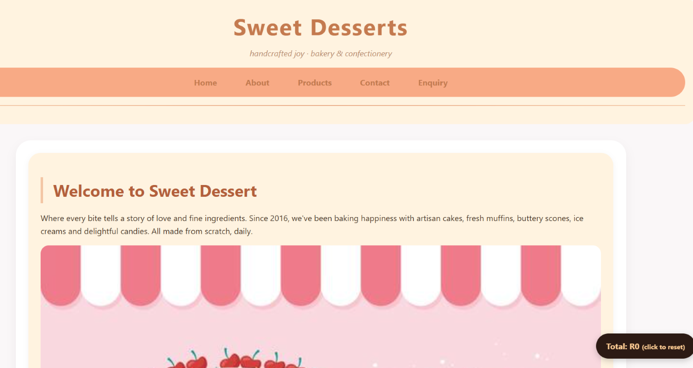
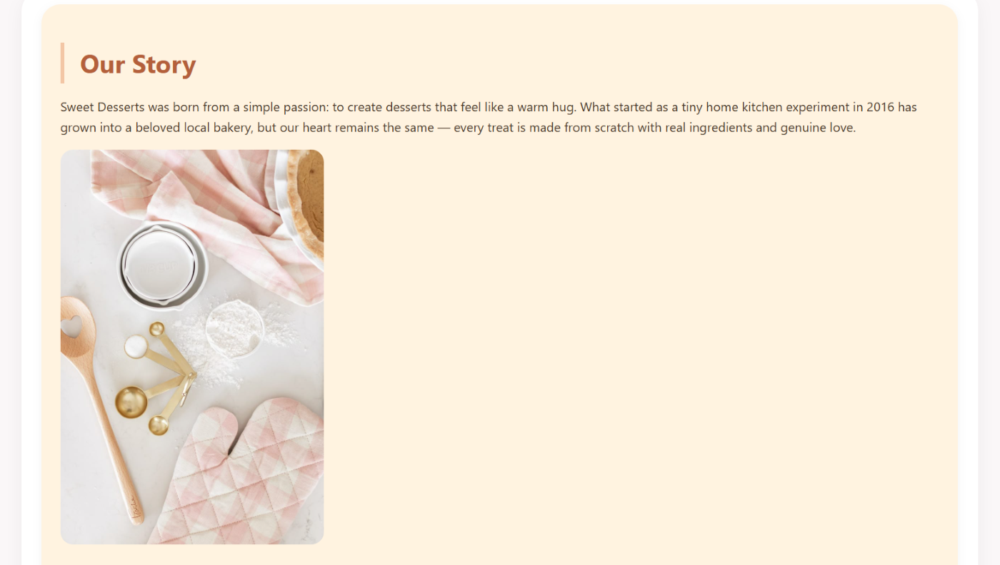
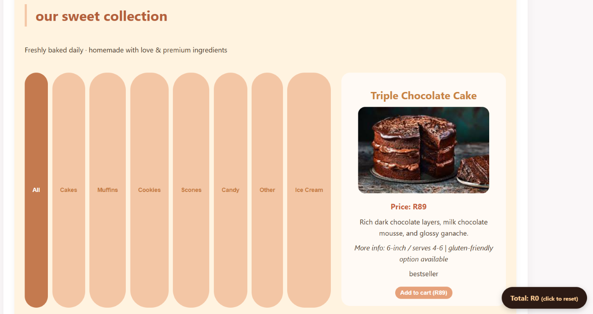
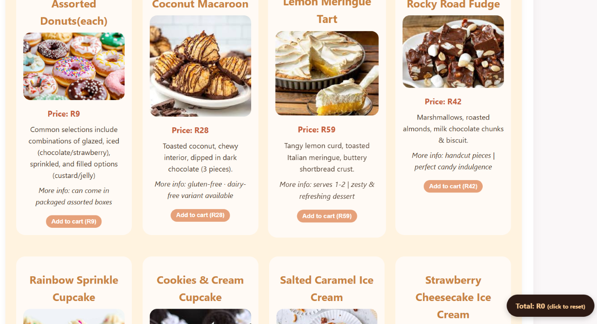
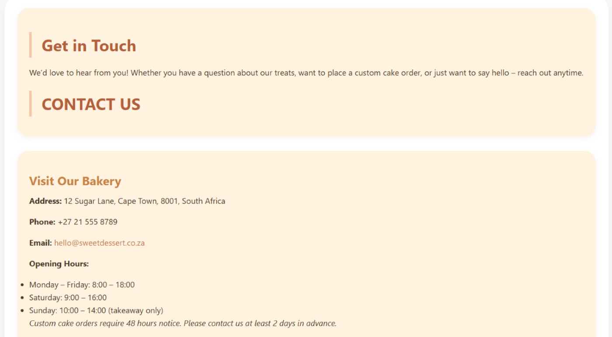
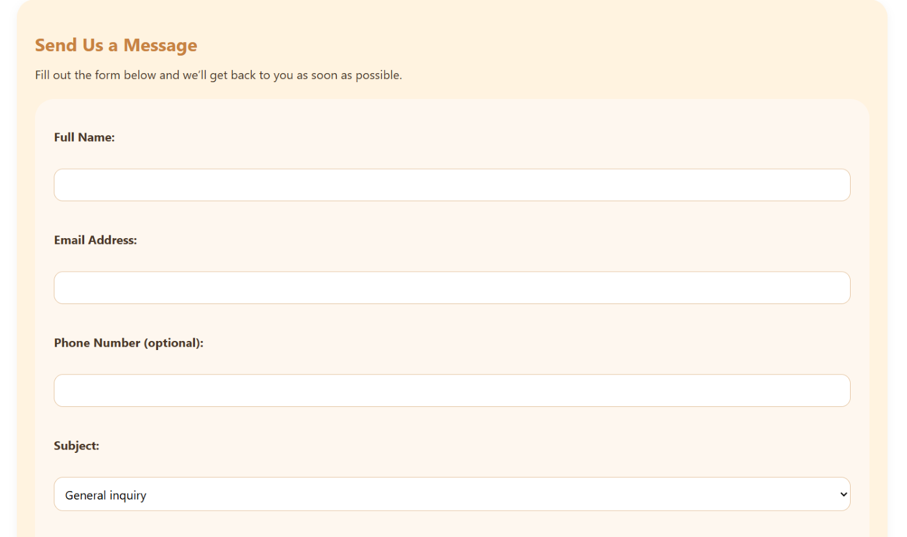
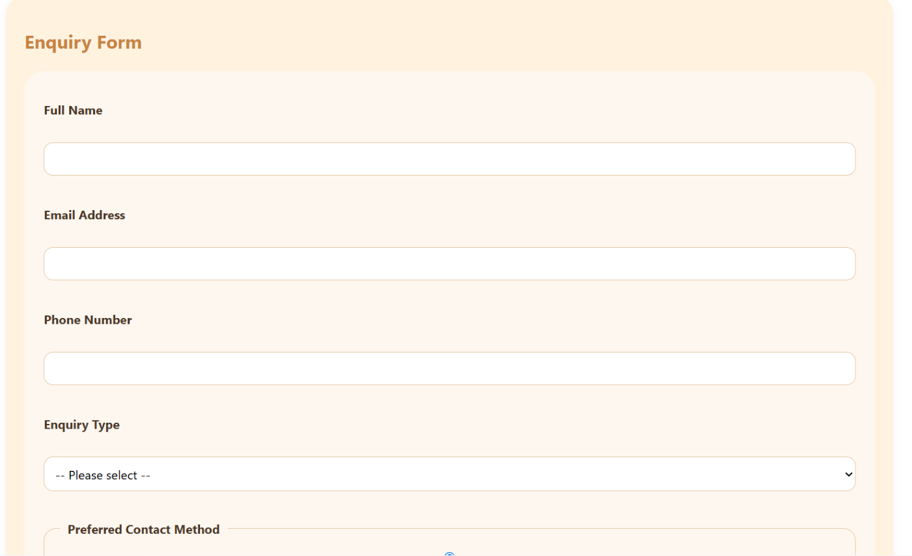

## website description
Sweet Desserts is a bakery selling handmade cakes, muffins, cupcakes, ice cream, scones, and candy. Freshly baked daily in Cape Town where every bite tells a story. The main goal of this project is to create an online presence that will reflect on the bakery product and customer service.

## features
- Fully linked pages: Home, Products, About, Contacts, Enquiry
- 16 desserts listed with images, descriptions, and prices
- Special offer banner repeated on every page
- Contact & enquiry forms
- Semantic HTML (<header>, <nav>, <main>, <section>, <article>, <footer>)

## Structure
- index.html-The main homepage
- about.html - page about our bakery/origin
- products.html - page of our full desserts menu/catalogue
- contacts.html - page of our contact details ad where we are located
- enquiry.html - enquiry form about our products

## How to run website
- Download or clone the project files
- Ensure all files maintain the same folder structure 
- Open any.html in any modern web browser e.g chrome, microsoft edge, firefox, safari
- Navigste the site using any page of your choice to excess the rest of the pages

## technologies used
- HTML5 for content structure
- CSS3 for styling and responsiveness
- JavaScript for product filtering, cart total simulator, form validation, sticky offer banner.
- printerest for images
- google maps for location display

## Sitemap
Sweet Desserts Website Sitemap

├── Home (index.html)
│   ├── Hero banner & welcome message
│   ├── Featured desserts (links to Products)
│   ├── Special offer banner (R200+ → free candy + muffin)
│   ├── Our Story (summary)
│   ├── Visit Us (address, hours, phone, email)
│   └── Customer testimonials
│
├─ About (about.html)
│   ├── Our Story (full version)
│   ├── Meet the Baker (Carol Ratshilumela)
│   ├── What We Believe In (values)
│   ├── From Our Kitchen to Your Table (product categories)
│   ├── Our Journey (timeline 2016–present)
│   └── Sweet Special (offer details)
│
├── Products (products.html)
│   ├── All desserts list (16+ items: cakes, muffins, cupcakes, ice cream, scones, cookies, candy)
│   ├── Special offer reminder
│   └── Link to Enquiry page for custom orders
│
├── Contacts (contacts.html)
│   ├── Visit Our Bakery (address, phone, email, hours)
│   ├── Send Us a Message (contact form)
│   ├── Map placeholder
│   ├── Sweet Special reminder
│   └── Quick Answers (FAQ)
│
└── Enquiry (enquiry.html)
    ├── Enquiry form (custom cakes, bulk orders, events)
    ├── Other Ways to Reach Us (phone, email, visit)
    ├── Special Offer reminder
    └── Quick Answers (common questions)

## screenshots of what to expect in each page (some not icluded)

HOME PAGE

ABOUT PAGE

PRODUCT PAGE

CONTACT PAGE

ENQUIRY PAGE

## Changelog

- Added full CSS styling (`style.css`) for all 5 pages 
- Responsive product grid – articles now display horizontally using flexbox
- Hover effects on navigation links, product cards, and sections
- Custom colour scheme
- Form styling with focus states and rounded buttons
- Mobile breakpoints at 768px and 480px
- Navigation bar background updated to improve contrast
- Section cards now have subtle shadow and lift‑on‑hover effects
- Improved readability on smaller screens
- improve image optimisation and changed width and height of banner in products page

- Added full JavaScript functionality (`script.js`) across all 5 pages
- Product category filters on Products page
- "Add to Cart" buttons with real‑time total calculator
- Floating cart total (bottom‑right corner)
- Automatic alert when total reaches R200+ (free candy/muffin reminder)
- Form validation in real-time for Contacts and Enquiry pages (required fields, email format, inline error messages)
- Sticky special offer banner on scroll

- Added meta description and meta keywords in each html page
- The `products.html` page now includes a lightbox-overlay `div` containers 
- Added Automatic gallery lightbox – Click any product image to open a full‑screen overlay with navigation arrows and keyboard support.
- Sections and cards now have subtle shadows and smoother transitions.
- Product images now have a slight zoom effect on hover to hint at clickability (if lightbox is active).

## References

* Barnard, L. and Wesson, J.L. 2003. Usability issues for E-commerce in South Africa: an empirical investigation. In Proceedings of the 2003 annual research conference of the South African Institute of Computer Scientists and Information Technologists. South Africa.
* Els, D. 2015. Responsive Design High Performance. Birmingham: Packt Publishing Ltd. Available at: <https://play.google.com/store/books/details?id=yTInCAAAQBAJ> [Accessed 21 April 2026].

* freeCodeCamp (2026) JavaScript algorithms and data structures certification. Available at: freecodecamp.org (Accessed: 19 June 2026)

* Goldstuck, A. n.d. The Hitchhiker's Guide to the Internet: A South African Guide to the Online World. South Africa: Penguin Random House. Available at: <https://www.goodreads.com/book/show/7784011-the-hitchhiker-s-guide-to-the-internet> [Accessed 23 April 2026].

* Kanton, I. (2026) An introduction to JavaScript. JavaScript.info. Available at: javascript.info (Accessed: 18 June 2026).

* Kona, O.T. and Weideman, M. 2014. Website interface design: a study on the status quo of South African e-Commerce website interfaces. Working Paper, Cape Peninsula University of Technology, Cape Town. Available at: <http://hdl.handle.net/11189/8031> [Accessed 21 April 2026].

* Toko, G. and Mnkandla, E. 2020. Computer Usability: Interactive Challenges Faced by Less Experienced Computer Users in South Africa. In Proceedings of the 12th International Conference on Computer Supported Education (CSEDU 2020), pp. 261-269. Available at: <https://www.scitepress.org/PublishedPapers/2020/93513/> [Accessed 21 April 2026].

* W3Schools. 2026. W3Schools Online Web Tutorials. Available at: <https://w3schools.com> [Accessed 25 May 2026].

## Author
- Ratshilumela Mulweli
